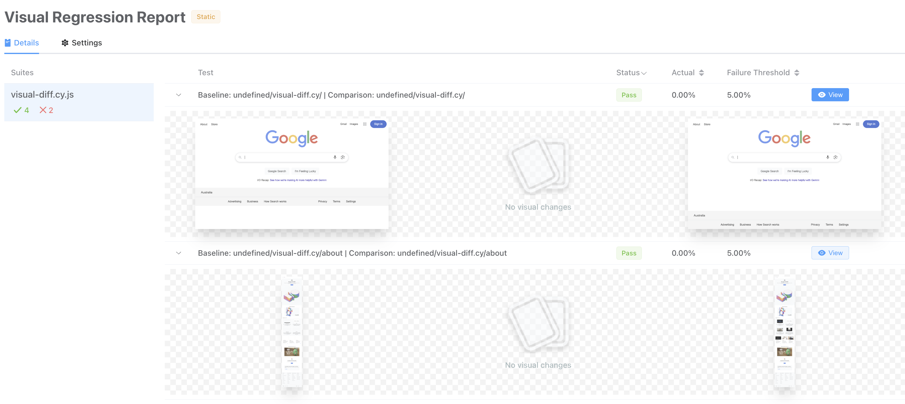
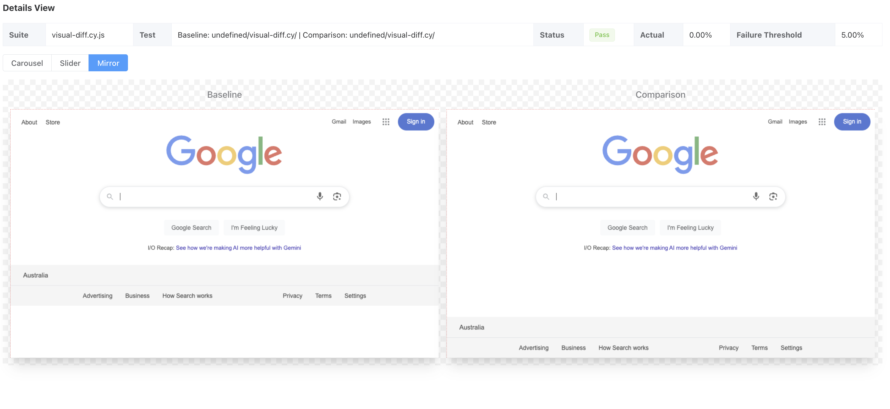
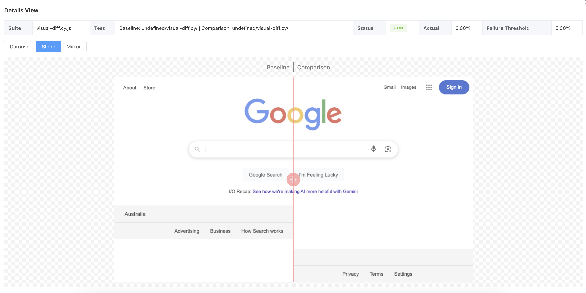

Visual Regression Testing using Cypress

* With Cypress (Testing Frameworks for Javascript), you can easily create tests for your modern web applications, 
* debug them visually, and automatically run them in your continuous integration builds.
  More Info https://www.cypress.io/

**Overview:**

This document provides a high-level overview of the Visual Regression Testing framework implemented using Cypress. 

The framework is designed to automate visual regression tests for different viewports and compare screenshots to detect visual differences.

**Requirements**

   1. Clone the repository 
   
        git clone git@github.com:althafhpa/cypress.git

   2. Install Cypress and Node modules

        npm install --include-dev

   3. Update baseurls for comparison and baseline in files 
        cypress.config.js, 
        cypress.config-baseline.js and 
        cypress.config-baseline.js
   
   4. Run Test ./baseline.sh and ./comparison.sh

        RUN ./baseline.sh

        RUN ./comparison.sh

   5. Generate Report 

        RUN ./report.sh

**See Below for Detailed Documentation**

**Components:**

**Test Configuration**

The test configuration is managed using environment variables.

For local test run add/update environment variables in cypress.env.json file.

For running tests using GitHub Runners, add/update environment variables in GitHub workflow yml. 

For local test, the required environment variables are in cypress.env.json.txt file. Rename this file to cypress.env.json and update the environment variables. 

For GitHub test add environment variables values to GitHub secrets and update those in the GitHub workflow yml file /.github/workflows visual-diff-advanced-parameter-split.yml

The environment variables that are used are:

BASELINE_URL: The URL of the baseline website.

COMPARISON_URL: THE URL of the comparison website.

HTTP_AUTH_USERNAME: baseline site have HTTP authentication username.

HTTP_AUTH_PASSWORD": baseline website have HTTP authentication password.

OKTA_USERNAME: comparison website OKTA username.

OKTA_PASSWORD: comparison website OKTA password.

OKTA_ANSWER: comparison website OKTA answer.

OKTA_DOMAIN: OKTA domain name that comparison site redirects to.

URLS_FILE: urls-local.json

SIMILARITY_THRESHOLD: 85

Envirnment variable URLS_FILE is only required for local test.

If you like to add a new workflow add your workflow yml under  /.github/workflows/

**Viewports**

The tests can executed across multiple viewports to ensure responsiveness:

Desktop: { width: 1000, height: 660 }
Tablet: { width: 768, height: 1024 }
Mobile portrait: { width: 414, height: 896 }

**End to End Test Script**

The test script file is cypress/e2e/visual-diff.cy.js

This file is the core component of the visual regression testing framework implemented using Cypress. 

Let's breakdown its structure and functionality:

The script performs visual regression testing by comparing screenshots between a baseline environment and a comparison environment to detect visual differences. It's designed to test multiple URLs across different viewport sizes.

**Key Components in the script file**
   
Test Configuration

const urlsFile = Cypress.env('URLS_FILE');
const data = require(`../fixtures/urls/${urlsFile}`);

The test reads a list of URLs from a JSON file specified in the environment variable URLS_FILE.
Each URL entry contains information about baseline and comparison paths, viewport dimensions, and device type.

Error Handling

cy.on('fail', (err, runnable) => {
return false;
});

cy.on('uncaught:exception', (err, runnable) => {
    return false;
});

The test is configured to continue on failures and uncaught exceptions.
This ensures that all visual differences are collected in a single run, rather than stopping at the first error.

Authentication

if(Cypress.config().baseUrl !== Cypress.env('BASELINE_URL')) {
cy.oktaLogin(Cypress.env('OKTA_USERNAME'), Cypress.env('OKTA_PASSWORD'), Cypress.env('OKTA_ANSWER'), Cypress.env('OKTA_DOMAIN');
}

The test handles authentication differently based on the environment:
For baseline sites: HTTP Basic Auth is used (implemented in the _baselineScreenshot function)
For comparison sites: Okta authentication is used when needed

Clone the test script and comment out the code to authenticate if you don't requyire login. You can also add new login mechanism following similar approach. Remember HHTP auth is context based and is required for each URL path and session won't work. All other logins should work similar to OKTA implementation. Save to session to speed up test and save resource similar to current implementation.
   
Test Execution Loop

data.forEach(pageObj => {
let image = pageObj.comparison;
let testName = `${image}-${pageObj.device}-${pageObj.width}px`;

it(`${Cypress.config().baseUrl}/${pageObj.comparison} | ${testName}`, function () {
    cy.viewport(pageObj.width, pageObj.height);
    
    if(Cypress.config().baseUrl === Cypress.env('BASELINE_URL')) {
        _baselineScreenshot(pageObj.baseline, testName);
    }
    else {
        _comparisonScreenshotAndCompare(pageObj.comparison, testName);
    }
});
});

The test iterates through each URL in the data file.
For each URL, it:

Sets the viewport dimensions based on the configuration
Determines whether to take baseline screenshots or comparison screenshots based on the current environment
Generates a unique test name that includes the URL path, device type, and viewport width

Screenshot Functions:

Baseline Screenshots

function _baselineScreenshot(path, testName) {
cy.visit(Cypress.env('BASELINE_URL') + '/' + path, {
    auth: {
        username: Cypress.env('HTTP_AUTH_USERNAME'),
        password: Cypress.env('HTTP_AUTH_PASSWORD')
    },
    failOnStatusCode: false,
    testIsolation: false,
});

cy.get('body').then($body => {
    hideElements($body, 'baseline');
    _takeScreenshot(testName);
});
}

Visits the baseline URL with HTTP authentication:

Hides elements that may cause visual differences (using the hideElements function)

Takes a screenshot using the _takeScreenshot function

Comparison Screenshots:

function _comparisonScreenshotAndCompare(path, testName) {
cy.visit(Cypress.config().baseUrl + '/' + path, {
    failOnStatusCode: false
});

cy.get('body').then($body => {
    hideElements($body, 'comparison');
    _takeScreenshot(testName);
});  
}

Visits the comparison URL:

Hides elements that may cause visual differences

Takes a screenshot and compares it with the baseline

Screenshot Capture

function _takeScreenshot(testName) {
return new Promise((resolve, reject) => {
    cy.wait(1000);

    cy.get('body').then(($body) => {
        const contentMainExists = $body.find('[data-block="content-main"]').length > 0;
        
        try {
            if (contentMainExists) {
                cy.get('[data-block="content-main"]')
                    .compareSnapshot({
                        name: testName,
                        capture: 'viewport',
                        errorThreshold: 0.05
                    })
                    .then(() => resolve());
            } else {
                cy.compareSnapshot({
                    name: testName
                })
                    .then(() => resolve());
            }
        } catch (error) {
            reject(error);
        }
    });
});
}

Waits for 1 second to ensure the page is fully loaded.

Checks if a specific element ([data-block="content-main"]) exists on the page.

Takes a screenshot of either that specific element or the full page.

Uses compareSnapshot from the cypress-image-diff-js plugin to compare screenshots.

Sets an error threshold of 5% for pixel differences.

Element Hiding:

function hideElements($body, testType) {
// Different elements are hidden based on whether it's a baseline or comparison test
if (testType === 'comparison') {
    // Hide elements in comparison environment
    // ...
}
else {
    // Hide elements in baseline environment
    // ...
}
}

Hides different elements based on whether it's a baseline or comparison test.

For comparison: Fixes image distortion (the screenhots breaks without this), adjusts layout containers, hides navigation elements.

For baseline: Hides headers, breadcrumbs, and sidebars that aren't part of the main content.,

**Summary:**

This script provides a comprehensive framework for visual regression testing that:

Supports multiple URLs and viewport sizes

Handles authentication for different environments

Intelligently captures screenshots of relevant content

Compares screenshots to detect visual differences

Continues testing even when errors occur

Hides elements that may cause false positives

The results are used to generate visual diff reports that highlight differences between the baseline and comparison environments.

If you have a different use case you can just clone the script and modify. 

For example you can remove existing authentication in the script and add the code for your authentication mechanism.

**Requirements**

1. Clone the repository 

2. Install Cypress and Node modules.

        In the package.json run below scripts.

        "scripts": {
        "install-dev": "npm install --include-dev",
        "cypress-install": "npm install cypress --save-dev",
        "postinstall": "patch-package"
    },

3. OPTIONAL: Install DDEV if you want to use Perceptual Hash Method       instead of Pixel Difference).

    We use a PHP library for Image Comparison so we need PHP installed so eitherv install DDEV or PHP.

    DDEV requires Docker container so install docker from any of below providers or other providers.

    https://www.docker.com/
    
    https://orbstack.dev/
    
    Install DDEV following instructions in the below link. 
    
    https://ddev.readthedocs.io/en/stable/users/install/ddev-installation/ 

    Once DDEV is installed in the project root (i.e cypress-automation incase you have cloned without specify any diectory). Run command,

    ddev config

    For Project use,
    
    PHP

    Start DDEV using command,
    
    ddev start

    Next time when you start Test make sure docker and DDEV is running. Just start docker and ddev.

**Running Test:**

**Local Test:**

1. Prepare Test Data:

Gather the comparison URL paths and baseline paths in a csv. Column 1 contains comparison path and column 2 baseline path. Column Titles are not required and also full URL path are not required i.e jsut the relative path.

2. Convert your CSV file containing test URLs to JSON:

node ./scripts/nodejs/csv-to-json.js ./cypress/fixtures/my-urls.csv

This will convert ./cypress/fixtures/urls.csv to ./cypress/fixtures/urls.json file.

The file csv-to-json.js is used to create json file called urls.json with mainly comparison and basline url paths along with id, device, width and height.

comparison and basline url paths are from the input csv file, id is auto incremented, device, width and height can be updated in the nodejs script.

{
"comparison": "/",
"baseline": "/",
"id": 1,
"device": "desktop",
"width": 1000,
"height": 800
},

3. Update cypress.config-baseline.js, cypress.config.js with  baseUrl configurations for baseline and comparison URLS for running test.

4. Update cypress.env.json for envioronment variables BASELINE_URL and COMPARISON_URL with values for baseline and comparison URLs. This is required during results merge.

5. Run Test Scripts.

To make it easier to run tests locally all the test scripts are added in the bash scripts.

Remember in local we are not running test in parallel. You can run test in Parrallel in GitHub Actions. See instructions for this in the later part of the document.

./baseline.sh

Capture baseline screenshots.

./comparion.sh 

Capture comparison and diff screenshots and generate reports JSON file.

./report.sh

Generates Visual Diff report.

These 3 scripts includes all the required commands to run test and generate report.

You can also run each commands inside the bash script one by one or include in your package.json scripts section and run.

Basline and Comparison test run differs in config file. Notice config file is specified in baseline test npx cypress run --config-file cypress.config-baseline.js  but in comparion default config is used.

**Pixel Difference or Perceptual Hashing**

Some cases you want to match exact pixels for Image Comparison but in some case you don't require Pixel match but just need to check similarity.

In this test we use Pixel difference and instead use Perceptual hashing method.

If you want to use Perceptual hashing method then uncomment line ddev exec php ./scripts/php/image-compare.php in report.sh for running test locally and visual-diff-advanced-parameter-split.yml

 For image similality using Perceptual hashing the values for image similarity are overwritten in the generated reports json created by cypress-image-diff https://www.npmjs.com/package/cypress-image-diff-js/v/1.22.0 using script image-compare.php which uses Perceptual hashing library from https://github.com/sapientpro/image-comparator and then final report is generated.

**Files under scripts/nodejs**

The script file scripts/nodejs/generate-matrix-config-chunks.js are used for mafrix configuration in GitHub workflow.  i.e in the matrix step it will create number of urls file for each runner in the format urls-1.json, urls-2.json etc based on value set in below code.

const numFiles = 50; 

Update below line for Number of URLs per file.

const urlsPerFile = 30;

The script file scripts/nodejs/-merge.js are used in GitHub workflow yml visual-diff-advanced-parameter-split.yml for merging reports generated in runners to single json file so we can generate the dashboard using a single json report.

scripts/nodejs/generate-matrix-config-chunks.js and scripts/nodejs/merge.js are not required to run test locally since we are not running parallel tests in  local. But we use scripts/nodejs/merge.js in local just for generating the merge.json file which is used for reporting.

The scripts under scripts/nodejs/add-ons are not required for running Test or Reports. See the nodejs script document for the usage of each script.

**GitHub Workflow visual-diff-advanced-parameter-split.yml**

This GitHub Actions workflow file is designed for visual regression testing with Cypress, allowing for two types of runs: baseline and comparison.

The final test artifacts are uplodaed to AWS s3 so it report can be viewed using browser. 

You can also upload artifacts to GitHub pages or any other storage. You could use an action https://github.com/actions/deploy-pages for pushing atifacts to GitHub Pages if you like.

**Key Features**

Manual Trigger with Parameters:

Triggered via workflow_dispatch with required inputs

run_type: Choice between "baseline" or "comparison"

baseline_run_id: Required when run_type is "comparison"

AWS Integration:

Uses AWS roles for accessing S3 storage

Uploads reports to an S3 bucket for persistent storage

Parallel Test Execution:

Splits URLs into chunks for parallel testing

Uses a matrix strategy to run tests concurrently

Two-Phase Testing Process:

Baseline phase: Creates reference screenshots

Comparison phase: Compares new screenshots against baseline

Artifact Management:

Uploads test artifacts between jobs

Downloads baseline artifacts for comparison runs

Merges results from parallel runs

Workflow Structure

Input Validation: Ensures baseline_run_id is provided for comparison runs

URL Preparation: Splits URLs into chunks for parallel processing

Matrix Configuration: Sets up the parallel execution matrix

Test Execution: Runs Cypress tests with appropriate configuration

Report Generation: Merges results and generates visual diff reports

S3 Upload: Uploads final reports to S3 for persistent storage

Environment Configuration

The workflow uses a combination of:

GitHub Secrets for sensitive data

Environment variables for AWS configuration

Dynamic configuration via cypress.env.json

Security Considerations

Uses GitHub's OIDC for AWS authentication

Masks sensitive AWS credentials

Stores credentials in GitHub Secrets

Notable Implementation Details

Uses retry mechanisms for failed tests

Implements proper cleanup between test runs

Handles artifacts with appropriate retention policies

Uses container-based execution for consistent test environment

This workflow represents a sophisticated implementation of visual 
regression testing in a CI/CD pipeline, with proper separation of baseline and comparison phases, parallel execution for efficiency, and secure credential handling.

**Purpose of patches/cypress-image-diff-html-report+2.2.0.patch**

Performance improvements for large reports: By implementing pagination and lazy loading of images, the patch makes the report more efficient for large test suites with many screenshots.

Support for external image URLs: The patch allows the report to reference images hosted externally (starting with "http"), which provides more flexibility in how screenshots are stored and referenced.

Customization of the report UI: The patch customizes the report title and appearance to match the project's branding.

Better navigation: The addition of pagination with navigation links makes it easier to browse through large reports.

These changes are particularly important for visual regression testing with many screenshots, as they make the reports more manageable and performant, especially when dealing with large numbers of test cases.

# OPTIONAL: Terraform Code for hosting Cypress Report

Created S3 Bucket and configured it to host a static website.

Uses Terraform Backend to store the state file in an S3 bucket.

It's using AWS Account:

aws technologies:

**S3**, **CloudFront**

Configuration That Needs to Be Updated

AWS Region:

Currently hardcoded to ap-southeast-2 in main.tf

Consider moving to variables.tf for flexibility

S3 Bucket Names:

Both website bucket and state bucket use project_name variable

Ensure uniqueness if deploying to different environments

CloudFront Configuration:

Using default CloudFront certificate

Consider adding custom certificate for production

Force Destroy Settings:

Both buckets have force_destroy = false

May need to be true for test environments

Tags:

Default tags contain placeholder information

Update with actual project details

Also refer .github/workflows/visual-diff-advanced-parameter-split.yml for more details how Terraform is used for hosting the report to Am Amazon s3.

Environment variables secrets for S3 Terraform needs to be updated in github/workflows/visual-diff-advanced-parameter-split.yml if using S3 to serve the report. 

